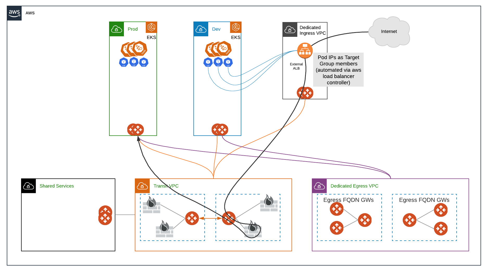
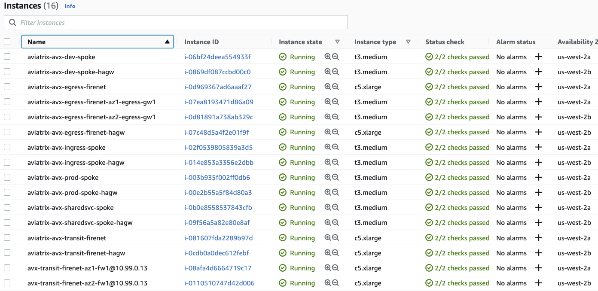

# Avx-EKS-ZTNA-Demo

## Description
This template deploys the following topology (minus creating the EKS clusters themselves):



It will create all of the VPC's, segmentation domains, connection policies, transit firenets with firewalls, egress firenet with egress fqdn gateways,fqdn tags, and an AWS ALB in the Ingress spoke with pre-configured listeners and target groups for a Prod and Dev app. To automatically populate the centralized ALB target groups when deploying pods into EKS, the aws-load-balancer-controller can be utilized. Deployment examples are included in this repository which showcase the use of TargetGroupBinding to automatically populate the IPs.

**NOTE: The Palo Alto Firewalls deployed with this template must be configured as per: https://docs.aviatrix.com/HowTos/config_paloaltoVM.html**

## Compatibility
Terraform version | Controller version | Terraform provider version
:--- | :--- | :---
1.0 | 6.5c | 2.21.0

## AWS Instances Created


## Variables

Modify ```terraform.tfvars``` as needed for your configuration.

- **region:** The region where you wish to deploy the template
- **account:** The Onboarded AWS account in the controller which will be used to deploy the resources in the template
- **spokes:** A map of spoke VPCs and their respective CIDRS. 
- **transit_firenet_cidr:** CIDR for the E-W Transit Firenet VPC
- **egress_firenet_cidr:** CIDR for the Egress Transit Firenet VPC
- **sharedsvc_cidr:** CIDR for the Shared Sevices Spoke
- **ingress_cidr:** CIDR for the Centralized Ingress Spoke

## Workflow

- Modify ```terraform.tfvars``` as needed
- ```terraform init```
- ```terraform plan```
- ```terraform apply --auto-approve```

### AWS Load Balancer Controller for Centralized Ingress
To deploy the aws load balancer controller and have it automatically update the Centralized ALB targetgroups, you will need to deploy the helm chart with a custom patch due to the following issue in the official image: https://github.com/kubernetes-sigs/aws-load-balancer-controller/pull/1862

Deployment instructions are here (use example below to deploy helm chart instead of the command in the doc): https://docs.aws.amazon.com/eks/latest/userguide/aws-load-balancer-controller.html

Example:

```
helm upgrade -i aws-load-balancer-controller eks/aws-load-balancer-controller \
--set clusterName=dev-cluster \
--set serviceAccount.create=false \
--set serviceAccount.name=aws-load-balancer-controller \
--set region=us-west-2 \
--set vpcId=<VPC ID of the Ingress Spoke> \  
--set image.repository=shoekstra/aws-alb-ingress-controller \
--set image.tag=latest-patch \  
-n kube-system
```

In the deployment yaml files, for the service use nodeport and configure a TargetGroupBinding with the ARN of the Centralized ALB target group:

```
---
apiVersion: v1
kind: Service
metadata:
  namespace: default
  name: prod-service
spec:
  ports:
    - port: 80
      targetPort: 80
      protocol: TCP
  type: NodePort
  selector:
    app: httpd
---
apiVersion: elbv2.k8s.aws/v1beta1
kind: TargetGroupBinding
metadata:
  name: prod-tgb
spec:
  serviceRef:
    name: prod-service
    port: 80
  targetGroupARN: arn:aws:elasticloadbalancing:region:account_id:targetgroup/prod-app/arn
  targetType: ip
```

With this configuration, when the pods are deployed/scaled, their IPs will automatically be added into the respective ALB targetgroup.

## Terraform state (post-provisioning)

```
aviatrix_fqdn.eks_fqdn
aviatrix_segmentation_security_domain.ingress_sd
aviatrix_segmentation_security_domain.sharedsvc_sd
aviatrix_segmentation_security_domain.spoke_sd["Dev"]
aviatrix_segmentation_security_domain.spoke_sd["Prod"]
aviatrix_segmentation_security_domain_connection_policy.spoke_to_ingress["Dev"]
aviatrix_segmentation_security_domain_connection_policy.spoke_to_ingress["Prod"]
aviatrix_segmentation_security_domain_connection_policy.spoke_to_sharedsvc["Dev"]
aviatrix_segmentation_security_domain_connection_policy.spoke_to_sharedsvc["Prod"]
aviatrix_transit_firenet_policy.app_inspect["Dev"]
aviatrix_transit_firenet_policy.app_inspect["Prod"]
aviatrix_transit_firenet_policy.ingress_inspect
aviatrix_transit_firenet_policy.sharedsvc_inspect
aws_lb.eks_centralized_alb
aws_lb_listener.Dev-App
aws_lb_listener.Prod-App
aws_lb_target_group.eks_dev_tg
aws_lb_target_group.eks_prod_tg
aws_security_group.ingress_alb_sg
aws_security_group_rule.dev_http
aws_security_group_rule.egress
aws_security_group_rule.prod_http
module.app_spoke["Dev"].aviatrix_segmentation_security_domain_association.default[0]
module.app_spoke["Dev"].aviatrix_spoke_gateway.default
module.app_spoke["Dev"].aviatrix_spoke_transit_attachment.default[0]
module.app_spoke["Dev"].aviatrix_spoke_transit_attachment.transit_gw_egress[0]
module.app_spoke["Dev"].aviatrix_vpc.default[0]
module.app_spoke["Prod"].aviatrix_segmentation_security_domain_association.default[0]
module.app_spoke["Prod"].aviatrix_spoke_gateway.default
module.app_spoke["Prod"].aviatrix_spoke_transit_attachment.default[0]
module.app_spoke["Prod"].aviatrix_spoke_transit_attachment.transit_gw_egress[0]
module.app_spoke["Prod"].aviatrix_vpc.default[0]
module.egress_firenet.aviatrix_firenet.firenet
module.egress_firenet.aviatrix_firewall_instance_association.firenet_instance1[0]
module.egress_firenet.aviatrix_firewall_instance_association.firenet_instance2[0]
module.egress_firenet.aviatrix_gateway.egress_instance_1[0]
module.egress_firenet.aviatrix_gateway.egress_instance_2[0]
module.egress_firenet.aviatrix_transit_gateway.default
module.egress_firenet.aviatrix_vpc.default
module.ingress_spoke.aviatrix_segmentation_security_domain_association.default[0]
module.ingress_spoke.aviatrix_spoke_gateway.default
module.ingress_spoke.aviatrix_spoke_transit_attachment.default[0]
module.ingress_spoke.aviatrix_vpc.default[0]
module.sharedsvc_spoke.aviatrix_segmentation_security_domain_association.default[0]
module.sharedsvc_spoke.aviatrix_spoke_gateway.default
module.sharedsvc_spoke.aviatrix_spoke_transit_attachment.default[0]
module.sharedsvc_spoke.aviatrix_vpc.default[0]
module.transit_firenet.aviatrix_firenet.firenet
module.transit_firenet.aviatrix_firewall_instance.firewall_instance_1[0]
module.transit_firenet.aviatrix_firewall_instance.firewall_instance_2[0]
module.transit_firenet.aviatrix_firewall_instance_association.firenet_instance1[0]
module.transit_firenet.aviatrix_firewall_instance_association.firenet_instance2[0]
module.transit_firenet.aviatrix_transit_gateway.default
module.transit_firenet.aviatrix_vpc.default
```
